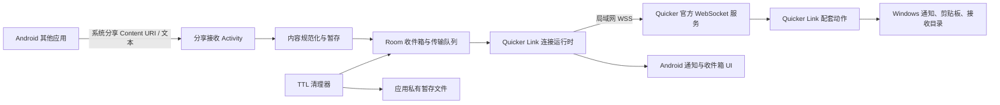
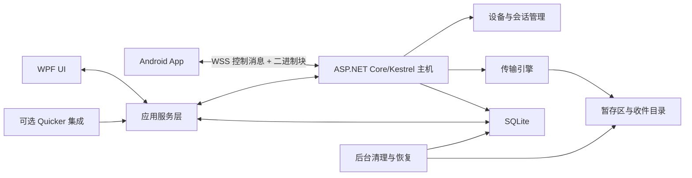

# 跨设备临时收件箱可行性与架构设计

- 状态：方案评估，尚未进入完整实现
- 适用范围：Quicker Link Android 10+ 客户端、局域网、仅 WSS
- 最后评估日期：2026-08-07

## 1. 结论

项目整体可行，但应分成两个阶段，不能把完整的跨设备收件箱一次性堆进 Quicker 动作。

第一阶段建议在现有 Quicker Link 上实现 `Inbox Lite`：复用已经稳定工作的局域网 WSS、配对、后台连接、通知、文本收发和 64 MiB 单文件传输，在 Android 侧增加系统分享入口、本地历史、过期清理和统一收件箱界面。该阶段能较快验证真实使用频率、内容类型、默认过期时间和文件大小分布。

当需求进入“Windows 端长期保存并检索历史”“Quicker 未运行时仍接收”“大于 64 MiB 的文件”“断点续传”“多手机与多电脑路由”或“并发传输”时，应拆出独立 Windows 常驻端。推荐使用 .NET 10、ASP.NET Core/Kestrel 和 WPF 的单进程程序起步，之后再按是否需要无界面常驻决定是否拆后台服务。

关键判断如下：

| 问题 | 结论 |
| --- | --- |
| 现有 Android + Quicker + WSS 是否可复用 | 可以，适合验证版和小规模内容传递 |
| 是否立即开发独立 Windows 程序 | 不立即；先用 Inbox Lite 验证需求，但提前保持协议和存储模型可迁移 |
| 第一版是否继续使用 WSS | 是。项目不提供明文 WS 降级 |
| 第一版文件是否继续走现有通道 | 是，限定单文件不超过 64 MiB，保持 64 KiB 串行分块 |
| 是否立即支持 100 MiB 以上文件 | 否。先做独立二进制流式原型，验证后再进入常规功能 |
| 是否立即做断点续传、秒传和并行分块 | 否 |
| 是否立即做网页端、账号和公网中继 | 否 |
| 是否值得继续 | 值得。现有通信基础已经覆盖最难的配对、认证、重连和双向传输起点 |

## 2. 现状与假设

### 2.1 已确认的现状

- Android 客户端最低版本为 Android 10（API 29），源码、测试、构建流程和公开文档继续在本仓库以 MIT 许可证公开，便于审计。
- Quicker Link 配套动作独立发布。动作核心实现不进入本公开 Android 仓库，也不属于本仓库的 MIT 授权范围。
- 当前连接只允许局域网私有 IPv4 上经过证书与主机名校验的 WSS，不支持 WS。
- Android 已有配对、认证、自动重连和可选前台服务，可在正常锁屏、切换应用和 Activity 重建后维持连接。它不保证开机自启、强制停止后在线或进程被系统终止后立即接收。
- 当前电脑到手机支持受限文本、通知和文件邀请；手机到电脑支持剪贴板文本和用户选择的单文件。
- 当前文件传输以 64 KiB 分块，经严格顺序、每块 SHA-256、完整 SHA-256 和 `.part` 临时文件校验后发布；单文件上限为 64 MiB，同一时刻只执行一个工具任务。
- 当前分块被编码在受控的文本请求/响应中，并不是直接使用 WebSocket 二进制帧。
- Android 当前主要以 `SharedPreferences` 保存连接和快捷项，尚无适合收件箱历史的 Room/SQLite 数据层。
- Android 当前尚未声明系统 `ACTION_SEND` 分享入口。

### 2.2 方案假设

- 第一批用户主要是一台 Windows 电脑和一台 Android 手机，最多扩展到少量已配对手机。
- 局域网是首选传输环境，不建设云端账号、云存储或公网中继。
- 收件箱管理的内容原件默认临时存在；“永不过期”是用户显式选择，而不是默认值。用户显式导出到 Downloads 或电脑接收目录的副本脱离 Inbox 的 TTL 管理。
- 接收文件只保存，不自动打开、执行或安装；URL 也不自动打开。
- 第一阶段允许 Windows 侧体验保持轻量，不承诺完整的常驻历史检索 UI。
- 现有 Quicker 官方 WSS 和配套动作继续作为第一阶段的 Windows 执行端。完整产品的独立 Windows 主机使用自己的协议端点，不复制或公开配套动作核心。

## 3. 推荐架构

### 3.1 第一阶段：Inbox Lite



第一阶段新增模块：

| 模块 | 职责 |
| --- | --- |
| Share Receiver | 接收 `ACTION_SEND` 的文本、URL、单图和单文件；取得临时 URI 读取权限 |
| Content Normalizer | 判断内容类型，清理标题与文件名，生成预览和稳定 ID |
| Inbox Repository | 使用 Room/SQLite 保存条目、传输状态和过期时间 |
| Transfer Orchestrator | 将收件箱条目映射到现有文本或文件传输，确保单任务串行和可取消 |
| Expiry Worker | 启动时、周期性和写入后处理过期记录与孤立暂存文件 |
| Inbox UI | 高信息密度列表、筛选、复制、打开、重试、修改过期时间和删除 |
| Companion Adapter | 把公开的收件箱领域请求映射到配套动作能力；核心实现仍留在动作发布物中 |

第一阶段复用项：

- WSS 连接、认证、配对码、自动重连与连接日志。
- Android 前台连接服务和电脑到手机的后台接收路径。
- 文件名清理、ContentResolver 流式读取、SHA-256、`.part` 文件与 MediaStore 保存。
- 64 KiB 分块、64 MiB 上限、单任务互斥、取消和最终提交确认。
- 电脑端可配置接收目录以及手机端“下载 / Quicker Link”目录。

第一阶段不应把 Quicker 动作改造成数据库服务器或长期运行的复杂桌面应用。Windows 侧只承担接收、保存、提示和有限的本地操作；Android 侧提供首个完整的收件箱历史体验。

### 3.2 完整阶段：独立 Windows 常驻端

达到任一条件时，应启动独立 Windows 端：

- 希望关闭 Quicker 窗口或不运行 Quicker 时仍持续接收。
- Windows 端需要完整历史、搜索、筛选、归档和多选操作。
- 需要稳定传输大于 64 MiB 的文件、断点续传或多任务并发。
- 需要一台电脑连接多部手机，或未来增加多电脑路由。
- 配套动作的状态、执行时间和 UI 线程限制开始影响可靠性。
- 收件箱代码明显超过配套动作适合维护和测试的规模。



Windows 第一版采用一个桌面进程最合理：WPF、Generic Host、Kestrel、SQLite 和后台任务共享依赖注入容器。这样部署、升级、日志和调试都更简单。关闭主窗口时可最小化到托盘并继续运行。

只有用户明确要求“退出 UI 后仍由系统级服务接收”、多 Windows 会话或提升权限边界时，才拆分后台服务与 WPF UI。拆分后需要额外的 IPC、安装器、升级协调、权限和崩溃恢复，过早拆分收益不足。

### 3.3 独立端的 WSS 配对

独立 Windows 端不能复制 Quicker 的证书方案，也不能把可复用的私钥随客户端分发。推荐：

1. Windows 首次启动生成设备密钥和本地 TLS 证书。
2. 配对二维码包含服务 ID、局域网地址、一次性配对码、证书公钥指纹和短有效期。
3. Android 首次连接只接受二维码中精确匹配的证书指纹，并要求 Windows 用户确认设备名称和指纹摘要。
4. 配对成功后双方保存独立设备令牌；Android 使用 Keystore，Windows 使用 DPAPI 保护。
5. 后续发现广播只发布服务 ID、端口和协议版本，不发布令牌或验证码。
6. 解除配对后服务端撤销对应设备令牌；旧令牌不能再次认证。

这仍然是 WSS，不是“忽略自签名证书错误”。信任仅来自面对面扫码得到的精确公钥指纹，不能使用接受任意证书的 TrustManager。

一次性配对会话必须有不可猜测的会话 ID、明确的过期时间、尝试次数上限和单次消费语义。服务端按 `requestId` 绑定用户确认结果；超时、错误验证码、用户拒绝或成功签发令牌后都关闭该配对会话。客户端不得在证书指纹不匹配时继续发送配对码，也不得把失败的配对请求作为普通重连自动重放。

## 4. 数据流

### 4.1 手机分享文本或 URL 到电脑

1. Android 分享接收页读取 `Intent.EXTRA_TEXT`，限制字符和 UTF-8 字节数。
2. 规范化器识别 URL，但只用于 UI 呈现，不自动请求网页标题或预览，避免隐私泄露。
3. 本地数据库先创建 `Queued` 条目，再交给发送队列。
4. 在线时通过当前已认证 WSS 发送；离线时保留为待重试，等待用户操作或连接恢复。
5. 电脑端幂等写入并返回已接收结果。
6. Android 将条目更新为 `Received`，失败时保存短错误码和可读摘要。

非幂等副作用不能因重连而自动重复。只有具有稳定 `messageId`、接收端能够幂等去重的内容投递才允许自动重试。

### 4.2 手机分享图片或文件到电脑

1. 分享接收页只接受 `content://` URI，并在系统授权范围内读取。
2. App 将输入流复制到应用私有 `.part` 文件，同时计算大小和 SHA-256；超过当前 64 MiB 时立即停止并删除临时文件。
3. `fsync` 成功后原子改名为待发送文件，并写入数据库。
4. 发送元数据，电脑端确认空间和策略后开始现有串行分块传输。
5. 电脑端写入 `.part`，完成后校验总大小和 SHA-256，再原子发布到用户配置的目录。Inbox Lite 中这一步属于用户发起的永久导出，不受 Android 条目 TTL 管理。
6. Android 收到最终确认后更新状态并删除自己的发送暂存副本。

不能把 Content URI 转成猜测的真实路径，也不能把整个文件读入内存。

现有 Quicker 配套动作没有 Windows 收件箱私有存储层，因此 Inbox Lite 不能承诺远程删除已经导出到电脑接收目录的文件。UI 必须把“本地条目过期”和“电脑导出副本”区分开；完整独立 Windows 端则先写入受管理的 spool，只有用户执行“保存”后才创建不受 TTL 管理的导出副本。

### 4.3 电脑发送到手机

1. 电脑本地用户或本地 Quicker 自动化创建内容邀请。
2. 文本和通知可直接入队；文件先由电脑端读取并计算元数据。
3. Android 在后台连接可用时接收邀请并写入本地数据库，然后发出不包含敏感正文的通知和可选提示音。
4. 小文本可按用户设置进入剪贴板；文件必须由用户确认后下载。
5. 文件校验完成后原子发布到 App 私有的受管理收件箱目录，数据库保存受控引用与显示名。
6. 用户点击“保存到下载”时才通过 MediaStore 创建导出副本；该副本由用户管理，Inbox 过期或删除时不自动移除。

进程被系统结束时，纯内存邀请会丢失，因此 Inbox Lite 必须在解析成功后先持久化再通知。配套动作需允许使用稳定内容 ID 重投尚未确认的邀请，但不能重复发布文件。

## 5. 数据模型

第一阶段不需要附件建议中的四张完整业务表。推荐先保留两张 Room 表，并继续复用现有配对配置：

### 5.1 `inbox_items`

| 字段 | 含义 |
| --- | --- |
| `id` | UUID，跨重试保持不变，唯一索引 |
| `kind` | `text`、`url`、`image`、`file` |
| `direction` | `incoming` 或 `outgoing` |
| `source_device_id` / `target_device_id` | 来源和目标；第一阶段允许目标为空表示当前已连接电脑 |
| `title` / `preview` | 有界展示信息；不得存整段文件内容 |
| `text_content` | 有界文本或 URL；文件类型为空 |
| `original_name` / `mime` / `size` / `sha256` | 文件元数据 |
| `managed_uri` / `staging_path` | Inbox 管理的私有原件引用，以及仅限应用私有目录的暂存路径 |
| `exported_uri` | 用户显式导出的副本引用；不为空时也不得由 TTL 清理器删除该副本 |
| `created_at` / `received_at` / `expires_at` | UTC 时间；永不过期时 `expires_at` 为空 |
| `state` | 条目状态 |
| `read_at` / `processed_at` | 本设备上的阅读与处理状态 |
| `error_code` / `error_summary` | 有界错误信息，不保存堆栈或正文 |
| `revision` | 乐观更新版本，防止异步结果覆盖新状态 |

### 5.2 `transfers`

| 字段 | 含义 |
| --- | --- |
| `id` | 传输 UUID，唯一索引 |
| `item_id` | 关联收件箱条目 |
| `direction` | 上传或下载 |
| `state` | `pending`、`negotiating`、`transferring`、`committing`、`completed`、`failed`、`cancelled` |
| `total_bytes` / `transferred_bytes` | 进度 |
| `chunk_size` | 当前协商的分块大小 |
| `staging_path` | 仅允许应用私有目录或服务端受控暂存目录 |
| `updated_at` / `attempt_count` | 恢复和诊断信息 |
| `error_code` | 有界机器错误码 |

设备列表第一阶段继续复用当前单连接配置。出现多个独立配对设备后，再新增 `devices` 表。不要在数据库中保存明文长期令牌；令牌只存 Keystore/DPAPI，数据库保存设备 ID 和令牌版本。

条目状态推荐：

```text
Draft -> Queued -> Offering -> Transferring -> Received -> Read -> Processed
                   |              |             |
                   +-> Rejected   +-> Failed    +-> Expired / Deleted
```

`Archived` 是展示属性而不是传输状态。删除在各设备上是本地操作；若以后同步删除，使用带时间戳的 tombstone，而不是假定所有设备同时在线。

## 6. 协议设计

本节描述可公开审计的收件箱领域协议，不是配套 Quicker 动作私有命令格式。第一阶段由适配层映射到现有能力，独立 Windows 端再原生实现。

### 6.1 JSON 信封

```json
{
  "protocol": "quickerlink.inbox",
  "version": 1,
  "messageId": "a4bb5b35-4e7e-4adb-8abc-9d3410bfb65a",
  "requestId": null,
  "type": "content.offer",
  "sourceDeviceId": "phone-01",
  "targetDeviceId": "desktop-01",
  "sentAt": "2026-08-07T08:00:00Z",
  "payload": {}
}
```

规则：

- `protocol` 和 `version` 必须精确匹配；不静默猜测旧版。
- `messageId` 是规范 UUID，并在接收端建立唯一索引，用于幂等去重。
- `requestId` 只用于关联响应；事件可为 `null`。
- 时间统一为 UTC ISO 8601，接收端不能仅依赖发送端时间判断安全超时。
- 每种 `type` 使用严格字段集合、长度和数量上限。未知类型返回 `unsupported_type`。
- 错误响应只包含稳定错误码和短摘要，不回传路径、堆栈、令牌或完整对象。

### 6.2 内容元数据

```json
{
  "itemId": "f65c406c-bef2-4591-8ef2-ae2fb6a59ce5",
  "kind": "file",
  "title": "report.pdf",
  "preview": "PDF · 3.4 MiB",
  "createdAt": "2026-08-07T07:59:58Z",
  "expiryPolicy": "day_1",
  "content": {
    "fileName": "report.pdf",
    "mime": "application/pdf",
    "size": 3565158,
    "sha256": "<64 lowercase hex characters>",
    "transferId": "f815ff36-5288-4d7c-b2c5-e2c25885617c"
  }
}
```

`expiryPolicy` 在第一版只允许 `hour_1`、`day_1`、`day_7` 和 `never` 四个精确值。接收端以自己的 `receivedAt` 为基准计算并持久化 `expiresAt`，响应中返回实际应用的策略与时间；发送端给出的绝对时间不能决定接收端保留期限。未知策略必须拒绝，不能静默改成永不过期。

`preview` 只用于展示且必须有长度上限，不能作为真实内容来源。文件名和 MIME 都是不可信提示；接收端必须再次清理文件名，并以实际内容策略决定如何打开。

建议消息类型：

| 分类 | 类型 |
| --- | --- |
| 会话 | `session.hello`、`session.ready`、`ping`、`pong` |
| 独立端配对 | `pair.request`、`pair.pending`、`pair.confirm`、`pair.reject`、`pair.success`、`pair.revoke` |
| 内容 | `content.offer`、`content.accept`、`content.reject`、`content.received` |
| 本地状态同步（后续） | `content.read`、`content.processed`、`content.delete` |
| 传输 | `transfer.start`、`transfer.ack`、`transfer.commit`、`transfer.complete`、`transfer.cancel`、`transfer.error` |
| 错误 | `error` |

Inbox Lite 只需要 `content.offer/accept/reject/received` 和当前文件状态机。阅读、处理和删除默认保留为各设备本地状态，避免第一版引入离线冲突合并。

### 6.3 独立端配对状态机

`pair.*` 只属于未来独立 Windows 端；Inbox Lite 继续复用 Quicker 现有配对，不用这组消息，也不公开映射到配套动作的内部命令。

1. Android 从二维码取得 `pairingSessionId`、`serviceId`、端点、一次性配对码、证书公钥指纹和过期时间，并先验证 WSS 证书指纹。
2. Android 发送 `pair.request`，携带配对会话 ID、一次性码、有界设备信息和新的 `requestId`。服务端检查过期、尝试次数、会话状态和速率限制。
3. 服务端返回 `pair.pending` 并在 Windows 本机显示设备名称和指纹摘要；只有本机用户可以作出决定。
4. 用户拒绝、超时或材料错误时返回 `pair.reject`，同时消费或关闭该配对会话；客户端必须重新扫码，不能无限重试。
5. 用户确认后，服务端通过 `pair.confirm` 在已固定证书的 WSS 中签发设备 ID 和单设备长期令牌。Android 使用 Keystore 成功保存后，以新令牌证明发送 `pair.success`，服务端才将设备标记为已配对。
6. 已认证设备或 Windows 本机可以发起 `pair.revoke`。服务端递增令牌版本、关闭该设备所有会话并拒绝旧令牌；撤销操作按请求 ID 幂等。

所有响应必须关联原始 `requestId`，配对码和长期令牌不得进入日志、数据库业务表或二维码之外的持久化文件。相同配对请求的网络重发只能返回既有状态，不能签发第二枚长期令牌。

### 6.4 文件通道

第一阶段继续使用当前动作适配层：64 KiB 数据块、Base64 文本封装、每块和完整文件 SHA-256、逐块确认、严格 offset、单任务串行。这样无需重写已经可用的电脑端实现，但不适合无限提高文件上限。

独立 Windows 端建议在同一条 WSS 会话中使用两种帧：

- 文本帧：JSON 控制消息、元数据、确认和错误。
- 二进制帧：文件块，头部包含协议标记、版本、传输 UUID、offset、长度和块摘要，后接原始字节。

第一版独立端仍只开一条 WSS 连接，用逻辑类型和 `transferId` 多路复用。没有必要立即维护独立控制 socket 和文件 socket。建议从 256 KiB 块、窗口 4 开始基准测试，根据 Android 内存、局域网延迟和 Windows 写盘表现调整；接收端定期确认连续写入的 `nextOffset`，无需每块都等待一次往返。

大文件传输完成条件必须同时满足：

1. 接收字节数等于声明大小。
2. 完整 SHA-256 匹配。
3. `.part` 已刷新到磁盘。
4. 数据库状态和最终文件发布按可恢复顺序完成。
5. 发送端收到具有相同 `transferId` 的最终确认。

HTTP/HTTPS 上传下载不是完整 MVP 的硬性要求。原生 Android 与 Windows 都能稳定使用 WSS 二进制帧，复用会话认证和连接状态更简单。未来加入浏览器/PWA、Range 下载、反向代理或多连接吞吐时，再增加同一认证体系下的 HTTPS 文件端点；不要为了“架构更标准”在第一版同时维护两套传输协议。

### 6.5 64 MiB 当前限制

64 MiB 不是 WebSocket 帧的理论极限。它是针对当前动作式传输主动设置的产品边界：

- 64 KiB 分块在上限处需要 1,024 次动作往返。
- Base64 会使块数据体积增加约三分之一。
- 上限约束动作执行时间、请求/响应大小、临时磁盘占用、Android 进程压力和滥用面。
- 当前单任务串行且不做通用断点续传；盲目提高到几百 MiB 会显著增加中途失败成本。

因此 Inbox Lite 保持 64 MiB 不变。未来提升上限的前提是独立 Windows 常驻端、WSS 二进制流、持久化 offset、磁盘空间预检、取消和重启恢复。应先用无 UI 原型验证 100 MiB、1 GiB、Wi-Fi 切换和进程重启，不应只修改一个常量。

## 7. TTL、本地持久化与清理

默认过期选项建议为 1 小时、24 小时、7 天和永不过期；产品默认值建议 24 小时。发送端传递固定枚举 `expiryPolicy`，接收端以自己的接收时间计算 `expiresAt`。用户之后修改期限时仍只选择受支持的策略；不能无条件接受远端绝对时间或任意超长期限。

存储所有权必须先于清理规则确定：

- **受管理原件**：位于 Android App 私有目录或未来 Windows spool，只由 Inbox Repository 引用，受 TTL、删除和孤立文件修复控制。
- **传输暂存**：`.part` 和待发送副本只用于一次传输，完成、取消、失败宽限期结束或条目过期后删除。
- **用户导出副本**：只有用户明确执行“保存到下载”或发送到现有电脑接收目录时产生，脱离 Inbox 所有权，不由 TTL 清理器删除。
- **历史记录**：可以记录导出结果和清理后的名称，但不得把外部导出副本伪装为仍受 Inbox 管理的原件。

因此 Inbox Lite 的 TTL 对 Android 受管理原件和本地记录生效；受现有 Quicker 动作限制，已经导出到电脑接收目录的副本由用户自行管理。完整独立 Windows 端必须采用同样的“受管理 spool -> 用户显式导出”边界，才能提供双端一致的临时内容语义。

清理时机：

- App 或 Windows 主机启动后。
- 周期后台任务运行时；Android 使用 WorkManager，系统不保证精确到分钟。
- 新内容完成或用户修改过期时间后。
- 用户执行“立即清理”时。

清理采用可恢复的两阶段流程：

1. 数据库事务将条目标记为 `Deleting`，并记录需要删除的受控文件引用。
2. 取消尚未提交的传输；正在查看或由发送任务持有 lease 的文件延后处理。
3. 删除受管理原件、应用私有暂存文件和缩略图；对用户明确保存到 Downloads 或电脑接收目录的导出副本只删除关联记录，不擅自删除用户文件。
4. 再次提交事务删除记录，或保留短期 tombstone 防止离线重投复活。
5. 删除失败时保留 `Deleting` 状态，下一次启动继续，而不是让数据库和磁盘永久分叉。

启动恢复还需要扫描受控暂存目录：没有数据库引用且超过宽限期的 `.part` 文件删除；数据库指向不存在文件的条目标记为 `Failed`，不伪装成已完成。

## 8. 安全与隐私

- 只支持 WSS，保持证书和主机名校验；不提供 WS 回退或“忽略证书错误”开关。
- 第一阶段继续限制目标为可达的局域网私有 IPv4。验证码允许按现有兼容策略留空，但 UI 应推荐非空验证码并明确风险。
- 独立端的二维码只放短期配对材料和证书指纹，不放长期设备令牌。
- 令牌每设备独立、可撤销、可轮换；服务端只保存哈希或受系统保护的密钥材料。
- 分享 URI、标题、文件名、MIME、大小、时间戳、设备名和所有 JSON 字段都视为不可信输入。
- 拒绝路径分隔符、控制字符、保留设备名和路径穿越；最终路径只能由受控根目录与清理后的叶文件名组合。
- 在接受文件前检查声明大小、实际可用空间、并发数量和允许上限；读取过程中再次执行硬上限。
- 不自动打开 URL、执行命令、安装 APK、运行收到的脚本或触发任意 Quicker 动作。
- 通知默认不显示敏感正文；日志只记录类型、大小、状态、短 ID 和清理后的名称，不记录令牌、完整文本、文件块或完整协议对象。
- 删除本地记录不等于安全擦除闪存；UI 应称为“删除”而不是“不可恢复销毁”。
- 数据只在已认证的局域网 WSS 会话与本地存储中流转，不引入统计 SDK 或云端预览服务。

公开边界必须保持明确：Android 网络、存储、UI 和协议验证代码公开可审计；Quicker Link 配套动作核心只通过 Quicker 动作库独立分发，不提交到本公开仓库。公开文档描述能力、安全边界和互操作领域模型，不披露动作内部实现。

### 8.1 本地有界日志

第一版不接入云端崩溃收集或统计 SDK。Android 使用应用私有目录中的结构化滚动日志，Windows 独立端使用 `Microsoft.Extensions.Logging` 接结构化滚动文件；两端通过同一事件名、级别、短关联 ID 和稳定错误码对齐诊断。

- Release 构建只持久化 `Information`、`Warning` 和 `Error`；高频分块进度只保留聚合结果，不逐块写盘。
- 默认最多保留 5 个文件、每个 1 MiB，并删除 7 天前日志；启动时和每次轮转后都强制执行数量、大小和时间上限。
- 记录协议版本、事件类型、方向、字节数、耗时、状态、错误码和短 ID；令牌、验证码、证书私钥、完整文本、文件块、完整路径、剪贴板正文和完整 JSON 信封一律不记录。
- 未处理异常只保留应用代码栈摘要和已脱敏的系统错误，不把用户内容或外部路径拼进异常消息。
- 用户可从设置页主动导出经过再次脱敏的诊断包；导出前显示内容范围，诊断包不包含 Room/SQLite 数据库、收件箱文件或配对材料，也不会自动上传。

## 9. 错误恢复与可靠性

| 情况 | Inbox Lite 行为 | 独立端目标行为 |
| --- | --- | --- |
| WSS 断开 | 当前请求失败；幂等待发送内容保留并提示重试 | 重新认证后按稳定 ID 恢复队列 |
| Wi-Fi 切换/IP 变化 | 自动重连；必要时重新发现或扫码 | 发现服务 ID，验证已保存证书指纹后重连 |
| 重复消息 | `messageId` 唯一索引返回已有结果 | 同左，并保留有界去重窗口 |
| 消息乱序 | 严格检查状态和 `requestId`，拒绝越级提交 | 按 transfer offset 和状态版本处理 |
| 传输中断 | 删除或定时清理 `.part`，用户重新发送 | 保存连续 offset，可人工或自动续传 |
| 最终确认超时 | 查询同一传输 ID 的提交结果，不重复发布 | `commit` 幂等，返回同一个最终记录 |
| 磁盘空间不足 | 开始前拒绝，写入失败立即停止并保留错误摘要 | 预留空间并持续监控 |
| 文件名冲突 | 生成安全、不覆盖的名称 | 同左，数据库保存原名与实际名 |
| 数据库写入失败 | 不发布最终文件；进入可恢复失败状态 | 使用事务和启动恢复协调文件发布 |
| 内容已过期 | 拒绝新传输或取消未开始任务 | 返回 `content_expired`，清理暂存数据 |
| 进程被结束 | Room 保留条目，启动后校正状态 | 数据库和 spool 恢复所有非终态任务 |

自动重试只适用于幂等操作。点击、打开、执行、系统控制和其他副作用命令不得因连接恢复而自动重放。

建议稳定错误码包括：`invalid_message`、`unsupported_version`、`unauthorized_device`、`content_too_large`、`content_expired`、`storage_insufficient`、`transfer_not_found`、`invalid_offset`、`checksum_mismatch`、`user_rejected`、`temporarily_unavailable` 和 `internal_error`。用户界面自行映射中文说明，不直接展示远端异常文本。

## 10. MVP 与非目标

### 10.1 Inbox Lite 必须完成

- Android 系统分享入口：纯文本、URL、单张图片、单个文件。
- 分享确认页：目标电脑、内容摘要、过期时间和发送按钮。
- Android 本地 Room 历史，进程重启后仍可查看状态。
- 收件箱列表：按全部、文本/链接、图片、文件和状态筛选。
- 复制文本、浏览器打开 URL、查看图片、打开受管理文件、显式保存到 Downloads、重试和删除；导出副本不随条目过期删除。
- 1 小时、24 小时、7 天和永不过期；默认 24 小时。
- 启动清理、周期清理、孤立 `.part` 清理和手动清理。
- 复用现有 WSS、配对、后台连接与通知。
- 单文件 64 MiB、单任务串行、进度、取消、SHA-256 和最终确认。
- 稳定内容 ID、基本幂等去重、短错误码和有界日志。
- 假 WSS/假动作端协议测试，以及至少一轮真实 Windows/Android 端到端测试。

### 10.2 可以推迟

- Windows 完整收件箱历史与搜索。
- 多文件和文件夹。
- 断点续传、滑动窗口、二进制帧和大于 64 MiB 文件。
- 多设备路由、在线设备列表和默认目标切换。
- 归档同步、已读同步、处理状态同步和远端删除。
- 拖拽发送、资源管理器右键菜单、快捷设置磁贴。
- 网页端/PWA、Markdown、代码高亮、OCR 和规则引擎。

### 10.3 第一阶段不建议加入

- 公网传输、云账号、云存储和公网中继。
- 聊天会话、群组和多人协作。
- 自动执行收到的程序、命令、APK 或任意 Quicker 动作。
- 文件秒传、内容去重、自动压缩和多块并行写入。
- 蓝牙、NFC、WebRTC、iOS 和浏览器扩展。
- 为尚未出现的多端冲突设计复杂 CRDT。

## 11. 原型验证计划

原型应按风险而不是按页面顺序推进：

| 原型 | 目标 | 验收条件 |
| --- | --- | --- |
| P0 分享 URI | 验证 Android 分享入口和 URI 生命周期 | 从浏览器、相册和两个文件管理器分享；进程重建后仍能读取已暂存内容；拒绝无权限 URI |
| P1 Inbox 存储 | 验证 Room、TTL 和文件一致性 | 重启后历史存在；过期记录与应用私有文件最终一致；故障注入后可恢复 |
| P2 现有链路投递 | 验证稳定 ID 和重复请求 | 文本、图片和 60 MiB 文件成功；断网重试不生成重复最终文件 |
| P3 后台接收 | 验证普通锁屏和切换应用 | 前台服务开启时收到文本、通知和文件邀请；进程恢复后邀请仍在数据库 |
| P4 独立端配对 | 验证证书固定、用户确认和令牌生命周期 | 正常扫码只签发一个设备令牌；指纹不符、错误或过期码、重复请求、用户拒绝均失败；撤销后现有会话关闭且旧令牌不能重连 |
| P5 大文件技术试验 | 验证独立端的必要性和方案 | 无 UI 的 .NET/Android 原型使用 WSS 二进制流稳定传输 100 MiB 和 1 GiB；内存有界；校验正确 |
| P6 重连/续传试验 | 决定是否进入独立 Windows 端 | 传输中断、Wi-Fi 切换、两端重启后能从已确认 offset 恢复，且不会重复发布 |

P5 不应通过临时调高当前 64 MiB 常量完成。它应使用独立、隔离的实验协议，结果达到要求后再决定生产协议和默认上限。

## 12. 测试策略

### 12.1 自动化测试

- 协议单元测试：每种信封和内容类型的成功解析、未知字段、超长字段、错误 UUID、非法时间、非法 `expiryPolicy`、版本不匹配和错误关联 ID。
- 状态机测试：正常传输、拒绝、取消、超时、重复 offer、重复 commit、乱序 ack 和过期竞态。
- 文件测试：0 字节、64 MiB 边界、超限 1 字节、短读、哈希不符、空间不足、冲突文件名和原子移动失败。
- TTL 测试：启动期间过期、程序关闭期间过期、正在传输、正在查看、删除失败和孤立 `.part`；受管理原件必须删除，用户导出副本必须保留。
- Repository 测试：数据库迁移、事务回滚、唯一 ID 去重和进程恢复。
- Android instrumentation：来自 `content://` 的分享 Intent、临时权限、MediaStore 保存、通知权限和前台服务生命周期。
- 网络集成测试：本地假 WSS 端模拟断开、延迟、重复响应、错误请求 ID、证书错误和限速；独立端原型另覆盖配对码过期与重放、用户拒绝、令牌撤销和旧会话关闭。

### 12.2 人工端到端矩阵

- Android 10、Android 13 和当前 Android 15 设备各至少一次。
- Windows 防火墙开启、IP 变化、Wi-Fi 重连、手机锁屏和应用退后台。
- 浏览器、相册、系统文件选择器和至少一个第三方文件管理器的分享入口。
- 中文、长文件名、同名文件、无扩展名、空文件和接近 64 MiB 文件。
- 清空验证码与推荐的非空验证码两种现有 WSS 认证模式。

## 13. 分阶段路线与验收

### 阶段 A：领域模型与分享入口

目标：不改变电脑端协议，先证明 Android 能可靠接住外部内容。

- 任务：Room schema、Repository、`ACTION_SEND`、内容规范化、私有暂存、基础列表和 TTL。
- 验收：文本、URL、单图和单文件能进入本地收件箱；重启不丢；过期清理无孤立文件。
- 依赖：无新的电脑端依赖。

### 阶段 B：Inbox Lite 双向投递

目标：把收件箱条目接入当前 Quicker Link 能力。

- 任务：稳定内容 ID、投递适配、状态更新、后台入库、重试、通知、进度和错误映射。
- 验收：两端文本和单文件可投递；60 MiB 文件校验成功；重连与最终确认超时不产生重复文件。
- 依赖：阶段 A、配套动作提供有界的幂等内容确认能力。

### 阶段 C：体验和可靠性收口

目标：让 Inbox Lite 可作为日常工具使用。

- 任务：筛选、快捷操作、修改过期时间、清理页面、存储空间提示、可访问性和完整测试矩阵。
- 验收：连续一周真实使用中无静默丢失、重复发布或长期残留 `.part`；错误可理解并可恢复。
- 依赖：阶段 B。

### 阶段 D：独立传输技术原型

目标：验证完整 FlowBox 的高风险部分，不制作正式 UI。

- 任务：.NET Kestrel WSS、二维码证书指纹配对、一次性配对状态机、二进制帧、滑动窗口、持久化 offset、100 MiB/1 GiB 传输和重启恢复。
- 验收：内存占用不随文件大小增长；中断可续传；完整哈希一致；未知证书、错误/过期/重放配对码必定拒绝；用户拒绝不签发令牌；撤销后旧令牌和既有会话立即失效。
- 依赖：Inbox Lite 的真实数据证明大文件或常驻端有需求。

### 阶段 E：独立 Windows MVP

目标：提供完整 Windows 收件箱和常驻接收。

- 任务：WPF 单进程主机、SQLite、托盘、收件箱 UI、传输页、设备管理、清理和迁移适配。
- 验收：关闭窗口后仍接收；重启恢复；多设备令牌可撤销；历史、TTL 和文件状态一致。
- 依赖：阶段 D 达标。

### 阶段 F：按实需扩展

根据实际使用数据选择断点续传正式化、多设备、HTTPS 文件端点、网页端或规则引擎，不预先承诺全部实现。

## 14. 工作量判断

| 范围 | 判断 | 主要工作量 |
| --- | --- | --- |
| 可行性、领域模型与协议设计 | 中等 | 明确现有动作边界、状态和迁移路径 |
| Android 分享入口 + Room + TTL | 中等 | Content URI 差异、持久化和文件一致性 |
| Inbox Lite 双向收发 | 中等偏复杂 | 幂等确认、后台生命周期、错误恢复和 UI 状态 |
| 独立大文件传输原型 | 较复杂且高风险 | WSS 配对信任、流控、续传、进程恢复 |
| 独立 Windows 完整 MVP | 较复杂 | 常驻生命周期、双端数据库、安装升级和大量边界测试 |
| 公网、多用户、云同步 | 高风险 | 身份、权限、服务运维、合规和成本，当前不做 |

单人开发时，Inbox Lite 是合理的一个中型版本；完整独立 Windows 端应视为后续主版本，而不是一个顺手追加的小功能。主要工作量不在列表 UI，而在分享 URI 生命周期、后台连接、文件与数据库原子性、幂等重试、证书配对和跨进程恢复。

## 15. 风险清单

| 级别 | 风险 | 影响 | 缓解措施 |
| --- | --- | --- | --- |
| 高 | 把完整收件箱塞进 Quicker 动作 | UI 阻塞、状态难恢复、维护困难 | 第一阶段只做适配和有限 Windows 操作，满足触发条件后拆独立端 |
| 高 | Android 分享 URI 权限短暂或来源实现不一致 | 文件入队后无法读取 | 分享入口立即流式复制到私有暂存，覆盖多个来源做真机测试 |
| 高 | 进程结束后内存邀请和状态丢失 | 用户看到通知却找不到内容 | 解析成功后先写 Room，再发通知；启动恢复所有非终态记录 |
| 高 | 直接提高 64 MiB 上限 | 数千次动作往返、失败成本和临时存储激增 | 保持现有限制，独立验证 WSS 二进制流后再提升 |
| 高 | 独立 WSS 使用任意自签名信任 | 局域网中间人攻击 | 二维码绑定精确公钥指纹，禁止通用忽略证书错误 |
| 中 | 文件和数据库发布顺序不一致 | 孤立文件或幽灵记录 | `.part`、事务状态、原子改名和启动修复 |
| 中 | 重连后重复发送 | 重复条目或重复文件 | 稳定 `messageId`/`transferId`、唯一索引和幂等 commit |
| 中 | Android 后台限制和厂商省电策略 | 后台消息延迟或遗漏 | 保留可选前台服务，明确不承诺强停/进程死亡在线，队列可恢复 |
| 中 | 多设备状态同步过早 | 冲突规则复杂、延期 | 第一阶段已读、归档和删除仅本地，多设备后再引入 tombstone |
| 中 | 日志包含正文或路径 | 隐私泄露 | 结构化有界摘要，禁止记录完整 envelope、文本和块数据 |
| 低 | MIME 或文件扩展名错误 | 打开体验差 | MIME 只作提示，保留安全原名并允许系统选择打开应用 |
| 低 | 精确周期清理受 Android 调度影响 | 内容比 TTL 稍晚清理 | 启动、写入后、周期和手动四个时机，UI 表述为最迟清理策略 |

## 16. 对关键问题的直接回答

1. 整体可行，且现有连接基础明显降低了验证成本。
2. 现有 Windows/Quicker + Android + WSS 适合扩展 Inbox Lite，不适合作为最终的大文件、多设备、长期历史后端。
3. 第一版采用 Android Room 收件箱、现有连接运行时、配套动作适配和受控目录，不新增独立服务。
4. 独立 Windows 端适合 ASP.NET Core + WPF 单进程，先托盘常驻，确有系统服务需求后再拆进程。
5. Inbox Lite 继续现有文件通道；独立端使用 WSS 二进制帧。HTTP 不是第一版必需。
6. 控制消息和文件数据应逻辑分离，但第一版独立端可复用一条 WSS 物理连接。
7. 第一版不需要单独 HTTP 上传下载 API；网页端或 Range 下载成为需求时再加。
8. Inbox Lite 不做断点续传；独立端在提高文件上限前必须先验证断点恢复。
9. 必须使用 WSS，项目不提供 WS 回退。
10. Android 延续可选前台连接服务；分享产生的用户主动传输可继续前台执行，状态先持久化，不承诺强停后在线。
11. 最容易失败的是 URI 生命周期、进程死亡恢复、文件与数据库一致性，以及把动作式传输误当作大文件流。
12. 公网、云账号、网页端、文件夹、秒传、复杂同步和自动执行应坚决推迟。
13. Inbox Lite 需要 Share Receiver、Normalizer、Room Repository、Transfer Orchestrator、Expiry Worker、Inbox UI 和 Companion Adapter。
14. WSS、认证、重连、前台服务、通知、文件暂存/校验、MediaStore 和当前传输状态机都可复用。
15. 历史存储、稳定内容 ID、持久化邀请、TTL 清理和未来大文件传输需要重新设计。
16. 先验证 Android 分享 URI 入库与恢复，再验证现有链路上的稳定 ID 去重；大文件另做隔离的二进制流原型。
17. 测试应覆盖严格协议解析、状态机、故障注入、数据库迁移、分享 Intent、假 WSS 和真实双端矩阵。
18. 单人按阶段 A 到 C 完成 Inbox Lite，收集使用数据后再决定是否投入阶段 D 和 E。

## 17. 最终建议

值得继续，但下一步不是生成一个完整的新项目。应先实现阶段 A 的最小纵向切片：从 Android 系统分享一段文本和一个 `content://` 文件，立即持久化到 Room，显示在收件箱中，支持 24 小时过期，并能通过现有已认证 WSS 投递到电脑。

这个切片同时验证分享入口、数据库、TTL、现有传输适配和错误恢复。只有真实用户持续遇到 64 MiB 限制、需要 Quicker 未运行时接收或明确要求 Windows 完整历史后，才进入独立 Windows 常驻端与大文件二进制协议。
